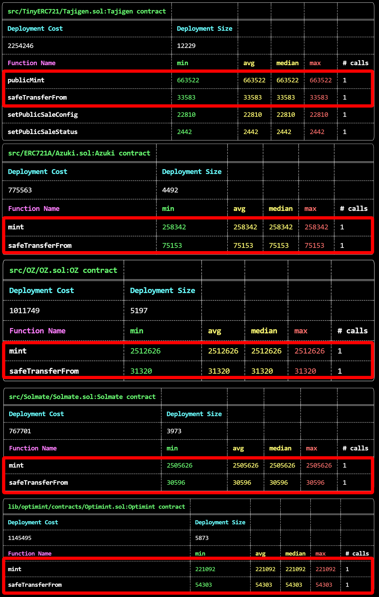

# ERC721 Implementations Gas Comparison

This repo uses [foundry](https://github.com/foundry-rs/foundry) to compare gas costs across different ERC721 implementations.

To run the tests run

`forge test -vvv`

To get a gas report, run

`forge test --gas-report`

## Gas Report

Comparing gas cost to mint 100 tokens in one transaction, as well as transfer one token.

